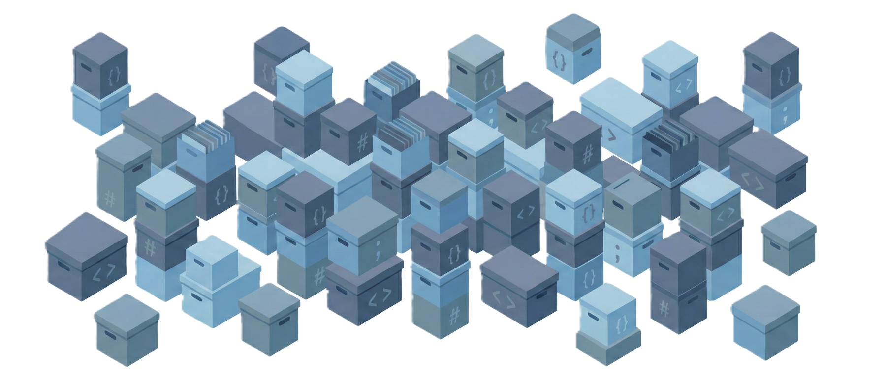

<p align="center">
  
</p>

<p align="center">
  
</p>

<h1 align="center"><a href="https://github.com/qtremors">ARCHIVE</a></h1>

<p align="center">
  A centralized <b>ARCHIVE</b> for projects during massive overhauls, deletions, or general archival.
</p>

<p align="center">
  
  
  
</p>

> [!NOTE]
> **Personal Project** 🎯 I built this to keep my workspace clean while preserving snapshot history from massive overhauls or deleted repositories. Feel free to explore and learn from the archived code!

---

## ✨ Features

| Feature | Description |
|---------|-------------|
| 🗄️ **Centralized Storage** | All major project overhauls and deleted repo dumps in one place. |
| 🛡️ **Universal Ignore** | Root-level `.gitignore` handles `node_modules` and build artifacts across all sub-projects. |
| � **Version Registry** | Every archived project is logged with its original version and archive date. |

---

## 🗄️ Archived Projects

| Project | Original Version | Date Created | Date Archived | Description |
| :--- | :--- | :--- | :--- | :--- |
| `git-nexus` | v2.0.0 | 20-11-2025 | 17-01-2026 | Github users & repo viewer tool. |
| `gitmig` | alpha | 17-12-2025 | 17-01-2026 | Repo Migration utility. |
| `locr` | v1.2.6 | 04-12-2025 | 17-01-2026 | Lines of code in repo counter. |
| `rtree` | v1.1.0 | 20-11-2025 | 17-01-2026 | Folder tree structure printer. |
| `tremors` | v2.2.1 | 21-12-2025 | 17-01-2026 | Personal Portfolio App. |
| `research` | alpha | 19-10-2025 | 23-01-2026 | A Research Hub. |

---

## 📁 Project Structure

```
archive/
├── git-nexus-v2.0.0/    # Archived Project
├── rtree-v1.1.0/        # Archived Project
├── ...                  # Other archived projects
├── .gitignore           # Universal ignore rules
└── README.md            # Repository index
```

---

## 📄 License

**Tremors Source License (TSL)** - Source-available license allowing viewing, forking, and derivative works with **mandatory attribution**. Commercial use requires written permission.

See [LICENSE.md](LICENSE.md) for full terms.

---

<p align="center">
  Made with ❤️ by <a href="https://github.com/qtremors">Tremors</a>
</p>
